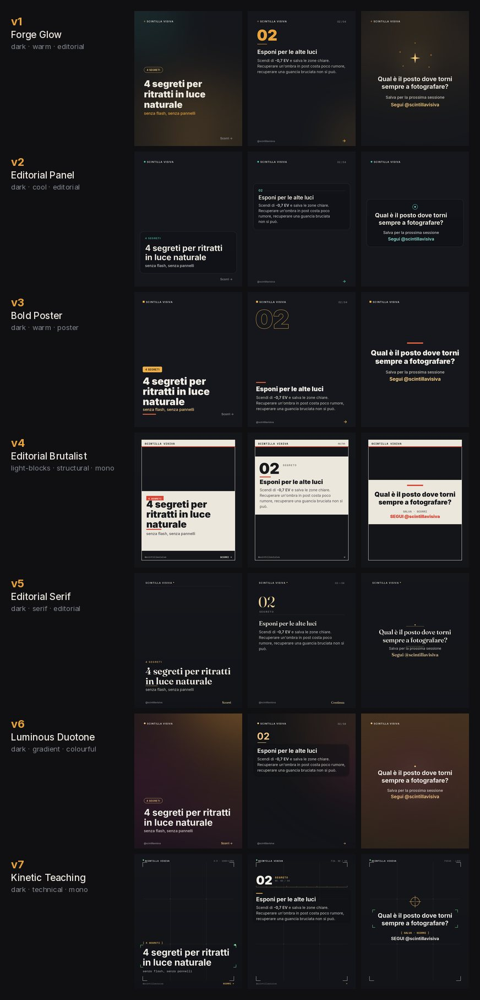

# Carousel Generator

**English** · [Italiano](README.it.md)

Turns a piece of writing into a finished Instagram carousel — 1080×1350, cover
plus one slide per point plus a call to action, ready to post.

A deck is two JSON files: **what it says** and **how it looks**. Nothing about a
look is hardcoded — palettes, type scales and the drawing recipe for every slide
all live in data, so a new style is a JSON file, not a code change. The same is
true of language and brand: the words a style draws around your copy come from a
locale file, and the handle and wordmark come from the deck.

```
content.json ──┐
               ├──► slide_NN.png ──┐
styles/v3.json ┘   (transparent)   ├──► final_NN.jpg   ← what you post
                                   │
bg_NN.png ─────────────────────────┘
(generated plates)
```

Seven styles ship. The same copy, rendered by each:



---

## Install

Python 3.9+ and Pillow are all you need to render.

```bash
pip install -r requirements.txt
python -m carousel.cli styles
```

Installing the package puts a `carousel` command on your PATH — the rest of this
document uses it:

```bash
pip install -e .
carousel styles
```

Generating background plates additionally needs `pip install openai` and an
`OPENAI_API_KEY` (copy `.env.example` to `.env`).

---

## The two files

| File | Owns | You change it when |
|------|------|--------------------|
| `content.json` | title, subtitle, badge, `secrets[]`, `cta_q`, `image_prompts[]`, caption | you write a new deck |
| `carousel/styles/*.json` | palette, fonts, type scale, slide recipes | you design a new look |

They are fully independent: the same content renders in any style, and any style
renders any content. Re-skinning a finished deck costs one command and reuses
the background plates you already paid for.

---

## Writing the content

Three ways, easiest first.

### From an article you already wrote

A long-form post converts directly if it is structured as a title, numbered
points and a closing question:

```bash
carousel import article.md
```

`# Title` becomes the cover, the line under it the subtitle, every `### …` a
point with its paragraph as the body, and the closing section's first line the
call to action. Intro copy and a trailing `Sources:` line are ignored — they are
context for the writer, not slides. The badge, the folder name and a
starting-point image prompt per slide are derived for you.

A worked example of that writing template, and of the editorial workflow it came
from, is in [examples/scintilla-visiva/](examples/scintilla-visiva/).

### By answering questions

```bash
carousel new
```

Asks for the title, subtitle, each secret and the closing question, and tells you
when a line is over budget for its slide *before* you commit to it.

### By hand

```json
{
  "name": "natural-light-portraits",
  "locale": "en",
  "handle": "@yourhandle",
  "wordmark": "YOUR BRAND",

  "title": "4 ways to shoot portraits in natural light",
  "subtitle": "no flash, no reflectors",
  "badge": "4 POINTS",
  "secrets": [
    ["Look for shade, not sun", "Step into **open shade**: the light arrives soft and even."]
  ],
  "cta_q": "Which place do you keep going back to shoot?",
  "image_prompts": ["<cover>", "<point 1>", "…", "<cta>"],
  "caption": "<full Instagram caption>"
}
```

`secrets[]` drives the whole deck: **N secrets → N+2 slides** (cover + secrets +
CTA), and `image_prompts[]` maps 1:1 onto those slides. Body copy supports
`**bold**` markup. A full worked example is in [examples/starter/](examples/starter/content.json).

### Length budgets

What actually fits a slide. `new` and `import` warn when copy runs past them;
`carousel check content.json` re-checks any deck, and catches a mismatched
prompt count or badge number before you render.

| Field | Budget |
|-------|--------|
| `title` | 9 words |
| `subtitle` | 8 words |
| each headline | 6 words |
| each body | 240 characters |
| `cta_q` | 14 words |
| `secrets` | 8 max — Instagram caps a carousel at 10 slides |

---

## Language and brand

Every style draws a few fixed words around your copy — a swipe cue, a save line,
the label above each point. Those live in `carousel/locales/`, not in the styles,
so one file re-languages all seven at once.

```json
{ "locale": "it" }
```

English and Italian ship. To add a language, copy `carousel/locales/en.json`,
translate the values and keep every key — every style speaks it immediately. A
deck can also override a single string without a new file:

```json
{ "locale": "en", "strings": { "save": "Pin this for later" } }
```

Brand works the same way. `handle` and `wordmark` on the deck are what a style
prints as the account mark; set them per deck when one install serves several
clients, or once in `carousel/config.py` if you only have one brand. Set neither
and the marks are simply not drawn — an unbranded deck renders cleanly.

So does the art direction of the generated plates. Each style carries its own
`image_style`, because the photography behind a brutalist look is not the
photography behind a duotone one, and a deck can override it:

```bash
carousel import article.md --style v4     # prompts art-directed for that look
carousel prompts content.json --style v6  # re-derive them after a re-skin
```

Nearest wins throughout: **deck → style → `carousel/config.py`**.

---

## Building the deck

Three separate commands, deliberately. Plates cost money and are art-directed,
so editing copy must never silently redraw them.

| Stage | Command | Produces |
|-------|---------|----------|
| 1. Render | `carousel render content.json -s v3` | `slide_NN.png` (transparent overlays), `deck.txt`, `caption.txt` |
| 2. Plates | `carousel plates <folder>` | `bg_NN.png` from the image prompts |
| 3. Compose | `carousel compose <folder>` | `final_NN.jpg` — the files you post |

`carousel build content.json -s v3` runs all three in one go.

Two behaviours worth knowing:

- **`plates` never overwrites an existing plate.** It generates only what's
  missing. `--only 3,5` targets specific slides; `--force` replaces deliberately.
- **`render` prunes orphans.** If a deck loses a secret, the leftover
  `slide_09.png` and `final_09.jpg` are removed and reported, so a stale slide
  can't slip into a post.

Composing writes JPEG, not PNG, on purpose: Instagram's Graph API rejects PNG
uploads with error `2207032`.

### Changing a deck's shape

Slides are numbered by position and a plate is a file named after a position, so
adding or removing a point mid-deck leaves every later `bg_NN.png` behind the
wrong copy. Worse, it does so *quietly*: keep `image_prompts` and the badge in
sync and `check` reports nothing, because nothing in a JSON file can see that
plate 4 was shot for what is now slide 5.

`reindex` repairs the mapping. Run it **before re-rendering** — it reads the
deck's `deck.txt`, which still describes the shape the plates were made for
until a render overwrites it:

```bash
carousel reindex decks/TODO-04-x --dry-run   # show the mapping
carousel reindex decks/TODO-04-x             # rename in a safe order
carousel plates  decks/TODO-04-x --only 3    # generate only what's genuinely new
```

It matches plates to slides by headline, so it handles a reorder as well as a
shift, and renames via temporary files so no plate can overwrite another. A
plate whose point you deleted is renamed `orphan_NN.png` rather than removed —
plates cost money, and you may want it back.

### Re-skinning a finished deck

Render into the deck's own folder and recompose. The plates are reused, not
regenerated:

```bash
carousel render decks/TODO-04-x/content.json --style v6 --out decks/TODO-04-x
carousel compose decks/TODO-04-x
```

To compare looks against your own copy before choosing:

```bash
carousel preview content.json --out preview/
```

---

## The styles

| Name | Label | Character |
|------|-------|-----------|
| `v1` | Forge Glow | Amber bloom on charcoal, giant numerals, brand spark |
| `v2` | Editorial Panel | Frosted translucent card, teal accent, lighter type |
| `v3` | Bold Poster | Oversized bottom-anchored type, hollow numerals, ember bar |
| `v4` | Editorial Brutalist | Cream blocks in a hard frame, mono masthead, signal red |
| `v5` | Editorial Serif | Fraunces magazine display, hairline rules, deep margins |
| `v6` | Luminous Duotone | Blurred jewel-tone wash that blooms with the photo |
| `v7` | Kinetic Teaching | Viewfinder grid, focus brackets, Space Mono HUD |

### Rotating the look across a series

Posting the same look twice in a row makes a feed look repetitive, so a deck can
take its style from its own number:

```bash
carousel render content.json --style auto
```

Deck 01 gets the first style, 02 the second, and it wraps — with seven styles
installed, deck 08 returns to the first. The number comes from the target
folder's name when you re-render one (`TODO-04-…`, `04-TO-POST-…` and `DONE-04-…`
all work), or from the number the next new deck will get. The chosen style is
always printed, so it is never a mystery:

```
style: v4 (auto, from folder TODO-04-natural-light)
```

`carousel styles --rotation` prints the whole mapping.

`v6` ships three palette variants. A deck picks one with its own `"palette"`
field, or its name selects one deterministically — so a given deck always renders
the same colours, while a run of decks cycles through the family.

---

## Writing a style

A style is JSON with five sections: `canvas`, `palette`, `fonts`, `type` and
`slides`. The recipe under `slides` is an ordered list of drawing ops.

```json
{
  "name": "midnight",
  "extends": "_base",
  "palette": { "scrim": [12, 14, 20], "ink": [240, 240, 235], "hot": [255, 92, 60] },
  "type": {
    "title": { "font": "sans", "weight": "Black", "size": 92, "leading": 104, "color": "ink" }
  },
  "slides": {
    "cover": [
      { "op": "vscrim", "top": 40, "bottom": 210 },
      { "op": "glow", "x": 540, "y": 1000, "r": 520, "color": "hot", "alpha": 70 },
      { "op": "measure", "name": "t", "value": "$title", "type": "title" },
      { "op": "cursor", "to": "H - 200 - t_h" },
      { "op": "text", "value": "$title", "type": "title", "x": "MX", "y": { "after": 0 } }
    ]
  }
}
```

Three ideas carry most of the expressiveness:

- **Expressions.** Any number can be arithmetic over the slide's variables:
  `"W - 2 * MX"`, `"H - 96"`. Parsed with `ast` against a whitelist, so a style
  file can do maths but cannot run code.
- **The cursor.** Text ops advance a layout cursor, so the next block sits at
  `{"after": 24}` instead of a magic coordinate. Copy of any length flows.
- **`measure`.** Measures text without drawing it, exposing `<name>_h`,
  `<name>_w` and `<name>_lines`. This is how a panel sizes itself to copy drawn
  *after* it, and how a block anchors to the foot of the slide.

Full schema and the complete op reference: **[docs/STYLES.md](docs/STYLES.md)**.
List the ops any time with `carousel styles --ops`.

### Designing one conversationally

Styles are meant to be written by describing a brand, not by typing coordinates.
Hand an AI `docs/STYLES.md`, one or two shipped styles as worked examples, and a
description of the brand — then check what comes back:

```bash
carousel styles --check my-brand.json
```

It loads the file, renders every slide kind with sample copy, and names the exact
step that fails:

```
error: midnight · cover slide · step 7 (op 'text'): unknown colour 'chartreuse'
       (palette has: hot, ink, line, muted, scrim)
```

That message is written to be pasted straight back into the conversation. Drop
the finished file into `carousel/styles/` and it appears in `carousel styles`
immediately.

[AGENTS.md](AGENTS.md) is the brief for that conversation, and for the other
jobs this tool deliberately leaves to judgement: writing the copy, writing the
image-prompt subjects, editing a deck, and looking at what came out.

---

## Making it yours

| What | Where |
|------|-------|
| Handle and wordmark | `handle` / `wordmark` in the deck, or `carousel/config.py` for a single brand |
| Look of the generated plates | `image_style` in the deck, else in the style, else `IMAGE_STYLE` in `carousel/config.py` |
| The words on the slides | `carousel/locales/<lang>.json` |
| Typefaces | drop a TTF in `fonts/`; its lowercased stem becomes the family name a style references |
| The look itself | a new file in `carousel/styles/` |

Nothing above requires touching Python.

---

## Layout

```
carousel/
  config.py       canvas size, font paths, brand constants
  style.py        loads style JSON, resolves palette/type/font tokens
  values.py       the expression evaluator
  fonts.py        font registry and variable-axis handling
  typography.py   wrapping, **bold** markup, letter-spacing, drawing runs
  engine.py       runs a style's recipes against a deck
  ops/            the drawing primitives styles call
  deck.py         content.json I/O, validation, folder naming
  authoring.py    markdown -> deck, the guided wizard, length budgets
  locales.py      the slide chrome, by language
  reindex.py      realigns plates when a deck gains, loses or reorders a point
  render.py       orchestration
  compose.py      slides + plates -> final JPEGs
  images.py       background plate generation
  cli.py          command line
  styles/*.json   the looks
fonts/            bundled TTFs
docs/             style reference, editorial workflow, caption guide
example/          a complete content.json
tests/
```

## Tests

```bash
python -m unittest discover tests
```

Covers every shipped style rendering a full deck in every shipped language, the
expression sandbox, deck validation and length budgets, markdown import, font
resolution, hollow type, unbranded decks, and the stale-slide pruning that stops
an orphaned `slide_09.png` from being posted after a deck loses a point. One
test fails the build if a style hardcodes a word that should have come from a
locale.

## Licence

MIT — see [LICENSE](LICENSE).

The bundled typefaces are **not** covered by it. Inter, Fraunces and Space Mono
are each under the SIL Open Font License 1.1; the licence text is in
[fonts/OFL.txt](fonts/OFL.txt) and the per-family copyright in
[fonts/README.md](fonts/README.md).

Contributions welcome — [CONTRIBUTING.md](CONTRIBUTING.md).
